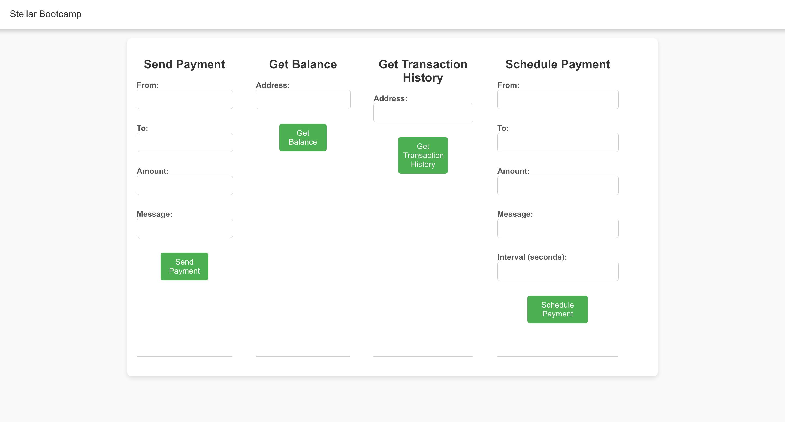

# Stellar Payment Platform

## About Me
Name: Berfin Zeliha Çiçek

Background: I am interested in developing blockchain technologies.

Skills: Stellar Blockchain, Rust, Node.js, React, and Motoko.

Project: A blockchain-based payment solution implemented on the Stellar network.


The Stellar Payment Platform is a blockchain-based payment solution implemented on the Stellar network. It allows users to perform secure XLM transactions, check balances, view transaction history, and schedule recurring payments. The frontend application is built using React and Node.js to provide a seamless user experience. Additionally, the backend is written in Rust, which ensures high performance and security.

 <!-- Update with your image path -->

## Smart Contract Features

### PaymentContract

- **Send Payment**  
  Transfers XLM between users with an optional message.  
  Validates sufficient balance, non-zero amount, and different sender and receiver addresses.

- **Get Balance**  
  Retrieves the XLM balance for a specified address.

- **Get Transaction History**  
  Provides the transaction history of a specified address.

- **Schedule Payment**  
  Allows scheduling recurring payments with a specified interval.

## Frontend Functionality

### Send Payment

1. Fill in "From", "To", "Amount", and "Message".
2. Click "Send Payment".
3. Displays the transfer result.

### Get Balance

1. Enter the "Address".
2. Click "Get Balance".
3. Shows the XLM balance.

### Get Transaction History

1. Enter the "Address".
2. Click "Get Transaction History".
3. Displays a list of transactions.

### Schedule Payment

1. Fill in "From", "To", "Amount", "Message", and "Interval (seconds)".
2. Click "Schedule Payment".
3. Sets up a recurring payment.

## Setup Instructions

1. Clone the repository:
   ```bash
   https://github.com/berfinncicek/payment-and-messaging-system.git

2. Navigate to the project directory:
   ```bash
   cd payment-and-messaging-system

3. Install dependencies:
   ```bash
   npm install

4. Configure Stellar SDK with your keys.

5. Start the project:
   ```bash
   npm start 
